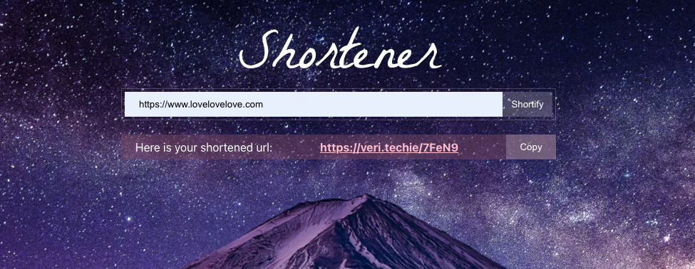

 <div style="text-align:center"></div>

# ⛰ Fuji Url Shortener
> A simple url shortener

A URL shortening service converts that long URL to a short, case-sensitive alphanumeric code. Simply put, this means that a URL shortening service takes ridiculously long URLs (web addresses) and makes them short.

## Installing / Getting started

This project was bootstrapped with [Create React App](https://github.com/facebook/create-react-app).

```shell
npm start
```

Runs the app in the development mode.\
Open [http://localhost:3000](http://localhost:3000) to view it in the browser.

Runs the app in the production mode.\
Open [https://react-url-shortener-back.herokuapp.com](https://react-url-shortener-back.herokuapp.com) to view it in the browser.

## Developing

### Technologies / Built With
- 💣  React 17.0.2
- 💅🏾  Styled Components 5.3.3

### Dependencies / Prerequisites
- validator 13.7.0

### Features
- Input field for the URL
- Button to shorten the URL
- Resulting shortened URL
- Copy to clipboard
- Link to the original URL

### Setting up Dev

Aquí hay una breve introducción sobre lo que debe hacer un desarrollador para comenzar a desarrollar
el proyecto además:

```shell
git clone https://github.com/VeroMoreno/react-url-shortener-front.git
cd the-proyect/
npm i
```

Install your dependencies and start developing.

### Deploying / Publishing

We use [GitHub Pages](https://pages.github.com/) to deploy the project.

Package.json
```shell
"deploy": "gh-pages -d build"
```

devDependencies
- gh-pages (npm i -D gh-pages)

"homepage":"https://veromoreno.github.io/react-url-shortener-front/",

## Versioning

[SemVer](https://semver.org/lang/es/) is used to version the project. 0.1.0 is the initial version.

## Api Reference

You can find the API reference in the <a target="_blank" href="https://github.com/VeroMoreno/react-url-shortener-back">react-url-shortener-back</a> repository.

Endpoints:
- POST / - Shorten a URL
- GET /:url - Redirects to the original URL (Comodin endpoint)


### Licensing

GNU GENERAL PUBLIC LICENSE

### Now what?

This is a project to test some knowledge so it lacks certain verifications